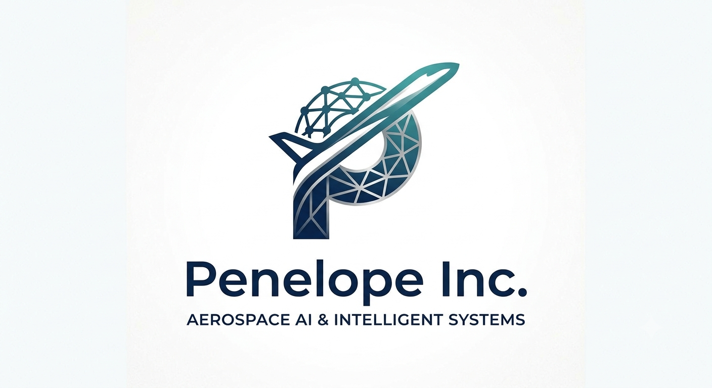

<!--
  PENELOPE INC. — GITHUB ORGANIZATION README
  Repository: Penelope-Inco/.github
  File:        profile/README.md
  Instructions: Create a new repository named `.github` inside the Penelope-Inco
                organization. Place this file at `profile/README.md`. GitHub will
                automatically render it on the organization's public page.
  Logo asset:  Upload `penelope-logo.png` to `.github/profile/assets/` and the
               img src below will resolve correctly.
-->

  

# PENELOPE INC.

**Aerospace AI & Intelligent Systems**

 

 

---

 

## The Problem

> *The next generation of aircraft will not just fly — they will think, authenticate, and self-diagnose in real time. The infrastructure to support that future does not yet exist at scale. Especially not for Africa. We are building it.*

 

Global aviation is converging on three hard, unsolved problems that existing primes have not addressed at the system level:

**I. Predictive integrity at the subsystem level.** Current MRO operates on scheduled maintenance intervals derived from fleet-average statistics — not from the actual physical state of the component in front of you. PHM technology exists, but deploying it rigorously requires physics-based models that most operators do not have.

**II. Cryptographic identity in safety-critical datalinks.** ADS-B, ACARS, and CPDLC were designed for transparency, not security. Retrofitting cryptographic identity onto protocols that require plaintext kinematics for TCAS creates a paradox that no deployed system has resolved. The attack surface grows with every new connected node.

**III. AI that a sovereign operator can actually own.** The emerging standard for aviation AI tooling is cloud-dependent, subscription-gated, and governed by a small number of US and European providers. Operators in Africa, Southeast Asia, and the Gulf cannot build defensible aerospace capability on infrastructure they do not control.

Penelope Inc. is an aerospace engineering practice working at the exact intersection of these three problems — grounded in physics, hardened by cryptography, and sovereign by design.

Our target is not to build tools for Airbus or Boeing's supply chain. We are building the **indigenous intelligent aerospace infrastructure layer** for markets the incumbent primes have systematically underserved — starting with Africa, scaling globally.

 

---

## The PHI Suite

**PHI — *Physics Hybrid Integrity*** — is our unified technology framework. Every system we build lives inside this architecture and is designed to interoperate.

 

<table>
  <thead>
    <tr>
      <th align="left">🔷 PHI-Twin</th>
      <th align="left">🔐 PHI-CHAIN</th>
      <th align="left">🏗 PHI-Arc</th>
    </tr>
  </thead>
  <tbody>
    <tr>
      <td valign="top"><strong>Physics-Informed Digital Twins</strong></td>
      <td valign="top"><strong>Blockchain Avionics Security</strong></td>
      <td valign="top"><strong>Intelligent System Architecture</strong></td>
    </tr>
    <tr>
      <td valign="top">
        High-fidelity fault detection and prognostic health management for aircraft subsystems. MATLAB/Simscape physics baselines fused with LightGBM and LSTM neural networks. Validated on gas turbine ignition systems and Dornier 228-212 landing gear to CS-23.473. Current production metrics: R² = 0.87 (turbine), 98.74% fault classification accuracy across 11 fault classes. FastAPI microservice with FlightGear UDP bridge. Submitted to IEEE Access and AIAA JAIS.
      </td>
      <td valign="top">
        The first aviation-grade blockchain protocol designed around the <strong>TCAS Paradox</strong> — the structural conflict between ADS-B kinematic transparency and cryptographic identity. Our <strong>Split-Payload Architecture</strong> resolves this with rotating Ghost IDs for plaintext kinematics and Ed25519 ciphertext tokens for node identity, deployed across ADS-B, ADS-C, ACARS, CPDLC, and HEALTH datalinks. A <strong>Physics-Informed Digital Twin Validator (PIDT)</strong> layer filters physically impossible messages from cryptographically valid nodes — catching spoofing that pure cryptographic verification cannot. Built on Hyperledger Fabric 2.5 with GF(2⁸) Shamir (2,3) threshold key management. RTCA DO-326A aligned.
      </td>
      <td valign="top">
        The integration and orchestration layer of the PHI Suite. PHI-Arc defines the system architecture, interface contracts, and deployment patterns that allow PHI-Twin and PHI-CHAIN to operate as a coherent platform — not a collection of isolated research artifacts. This includes microservice mesh, sensor fusion pipelines, hardware abstraction layers, and the operator-facing toolchain from raw sensor stream to maintenance decision. PHI-Arc is where the engineering meets the operator.
      </td>
    </tr>
  </tbody>
</table>

 

<strong>⚡ Penelope Agent — Sovereign AI Runtime</strong>

 

A Python-based, offline-first AI reasoning engine designed for environments where cloud dependency is a liability. Architecture: multi-provider cloud cascade (Groq → Gemini → Qwen → Mistral → DeepSeek → Cerebras, with local Ollama fallback), hardware soul-lock via GF(2⁸) cryptographic binding, ReAct agentic loop, LLM-based task classification, and physics unit validation. Runs entirely on local hardware. No data leaves the machine by default. Designed for aerospace operators in environments where cloud connectivity cannot be assumed and data sovereignty is non-negotiable.

This is what sovereign AI looks like in practice.

 

---

## Engineering Philosophy

We operate by a small number of non-negotiable principles. They are not aspirational values on a wall. They are structural load-bearing constraints on how we build.

 

**01 — Ground Everything in Physics First**

Before any model is trained, the governing equations must be correct. We build ODE-based MATLAB simulators before we build neural networks. Synthetic data is validated against known thermodynamics and structural mechanics. We do not use ML to paper over a physics deficit.

**02 — Security Is a Design Input, Not a Post-Hoc Feature**

Every system we design is threat-modeled before the first line of code. RTCA DO-326A is not a compliance checklist we reference in documentation — it is a constraint we design around from day zero. The TCAS Paradox exists because security was bolted on. We resolve it architecturally.

**03 — Sovereignty Is a First-Class Requirement**

We do not build systems that require a US or European cloud provider to function. Offline-first. Local-first. Hardware-bound where appropriate. This is not a technical preference — it is a strategic requirement for any operator who intends to own their own aerospace capability.

**04 — Ship Working Systems, Not Just Papers**

Research without a deployable artifact is incomplete. Every project at Penelope Inc. produces a running system: a compiled binary, a live API, a functioning blockchain node, or a deployed desktop application. Publications follow the product. Not the other way around.

**05 — Depth Is the Moat**

We go very deep on a small number of problems. We do not pivot with trends. We are building at the layer where physics, cryptography, and systems engineering must all be simultaneously correct — and that requires patience and precision that cannot be shortcut.

 

---

## Technology Stack

| Layer | Technologies |
|:---|:---|
| **Physics & Simulation** | MATLAB R2024b, Simscape Multibody, OpenFOAM v2406 |
| **Machine Learning** | PyTorch, LightGBM, scikit-learn, ONNX Runtime, CVAE |
| **Systems Core** | Rust 1.96, Tauri v2, C/C++ |
| **Backend & APIs** | Python 3.12, FastAPI, PostgreSQL, PocketBase |
| **Blockchain** | Hyperledger Fabric 2.5, Ed25519, GF(2⁸) Shamir (2,3) threshold |
| **Desktop & UI** | Tauri v2, React 19, TypeScript |
| **AI Runtime** | Whisper (offline STT), ONNX, Ollama local inference |
| **Data & Research** | HuggingFace Datasets, Kaggle, LaTeX (AIAA class) |
| **Deployment** | Docker, Fly.io, Vercel, GitHub Actions CI/CD |
| **Standards** | CS-23.473 · RTCA DO-326A · AIAA manuscript standards |

 

---

## Active Research Pipeline

| Project | Target Venue | Status |
|:---|:---|:---:|
| Physics-Consistent CVAE for RDE CFD Spatiotemporal Data Augmentation | AIAA SciTech Forum 2027 | 🟡 In Preparation |
| PHI-CHAIN: Split-Payload Blockchain Architecture for Avionics Cybersecurity | AIAA SciTech Forum 2027 | 🟡 Abstract Phase |
| Gas Turbine Ignition Digital Twin with Physics-Informed PHM | IEEE Access | 🔵 Under Revision |
| Landing Gear PHM — Dornier 228-212, CS-23 Compliant | AIAA JAIS · NIGERCON 2026 | 🟠 Under Review |
| RDE-72: Synthetic CFD Dataset (72 fields, 10.57967/hf/8884) | HuggingFace · Kaggle | ✅ Published |

 

---

## Founder

<table>
  <tr>
    <td valign="top" width="70%">
      <strong>Mohammed Bello Sani</strong> 
      Aerospace Engineering, Air Force Institute of Technology — Kaduna, Nigeria 
      Incoming M.Sc. — Smart Aviation Center, Beihang University (Hangzhou Innovation Institute) 
      Supervisor: Prof. Hu Yang · Focus: Digital Twin-Based Intelligent Maintenance  
      Research identity: <em>Aviation Digital Engineering & Intelligent Systems</em> — spanning PHM, physics-informed digital twins, avionics cybersecurity, and sovereign AI. Peer reviewer, AIAA JAIS. AIAA student member.  
      <a href="https://github.com/Sm-bello">github.com/Sm-bello</a> · <a href="https://smbello.vercel.app">smbello.vercel.app</a>
    </td>
    <td valign="top" align="center" width="30%">
       
      @Sm-bello
    </td>
  </tr>
</table>

 

---

## Work With Us

Penelope Inc. is not a startup looking for warm bodies. We are looking for **builders who think in systems** — engineers who can hold physics, software architecture, and adversarial security simultaneously, and who ship things that work in the real world.

If you are:

- A **controls, systems, or structures engineer** who wants to apply real physical models to PHM problems — not toy datasets
- A **cryptographer or security researcher** who cares about aviation-grade threat modeling and has thought about the limits of ADS-B security
- A **Rust or Python engineer** who wants to build production aerospace software, not proof-of-concept demos
- A **researcher** interested in physics-informed ML, CFD augmentation, or fault detection on real subsystem data
- An **investor or institution** seeking early exposure to indigenous African deep-tech aerospace infrastructure

...then we should have a conversation.

We collaborate openly on research and selectively on product development. Pull requests on open components are welcome. Proposals for collaboration on PHI Suite development should come through direct contact.

 

---

## Get in Touch

📧 **[contact@penelope-inc.io](mailto:contact@penelope-inc.io)**

 

 

---

*"We are building the aerospace intelligence infrastructure that Africa — and the world — will need for the next half-century. The physics is understood. The cryptography is proven. The only question remaining is execution."*

**— Mohammed Bello Sani, Founder, Penelope Inc.**

 

© 2025 Penelope Inc. · Aerospace AI & Intelligent Systems · Abuja, Nigeria
Physics Hybrid Integrity (PHI) · PHI-Twin · PHI-CHAIN · PHI-Arc · Penelope Agent

